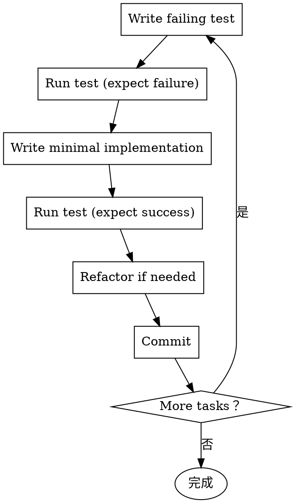

# /super-opsx-apply

执行 OpenSpec 变更的实现，使用 Superpowers TDD 流程。

## 概述

此命令读取 OpenSpec tasks.md 并使用 Superpowers 的执行流程实施，遵循 TDD 原则。

## 执行步骤

### Step 1: 读取 tasks.md

从当前变更目录读取任务列表：

```
openspec/changes/<current-change>/tasks.md
```

解析任务格式（参考 [format-mapping.md](../super-opsx/references/format-mapping.md)）：

```markdown
## 1. Infrastructure
- [ ] 1.1 Create JWT utility
- [ ] 1.2 Add token validation

## 2. API Endpoints
- [ ] 2.1 Implement login endpoint
- [ ] 2.2 Implement refresh endpoint
```

### Step 2: 创建隔离工作空间

**宣布：** "我正在使用 superpowers:using-git-worktrees 技能来创建隔离工作空间。"

调用 `superpowers:using-git-worktrees`：
- 创建独立的 git worktree
- 确保不在 main/master 分支上直接工作

### Step 3: 执行模式选择

根据平台能力选择执行模式：

| 平台 | 执行模式 | 技能 |
|------|---------|------|
| 支持 Subagent | 并行执行 | `superpowers:subagent-driven-development` |
| 不支持 Subagent | 顺序执行 | `superpowers:executing-plans` |

### Step 4: TDD 流程（每个任务）

**宣布：** "我正在使用 superpowers:test-driven-development 技能。"

遵循 TDD 循环：



#### TDD 步骤详解

1. **Write failing test**
   - 为当前任务编写失败的测试
   - 测试应该描述期望的行为

2. **Run test (expect failure)**
   - 运行测试，确认失败
   - 记录失败原因

3. **Write minimal implementation**
   - 编写刚好使测试通过的最小代码
   - 不要过度设计

4. **Run test (expect success)**
   - 运行测试，确认通过
   - 如果失败，修复实现

5. **Refactor if needed**
   - 清理代码
   - 确保测试仍然通过

6. **Commit**
   - 提交代码
   - 更新 tasks.md 的 checkbox

### Step 5: 进度跟踪

每完成一个任务：

1. 更新 `tasks.md`：
   ```markdown
   - [x] 1.1 Create JWT utility
   ```

2. 报告进度：
   ```
   Task 1 complete! [1/8]
   Moving to Task 2...
   ```

### Step 6: 完成开发

所有任务完成后：

**宣布：** "我正在使用 superpowers:finishing-a-development-branch 技能来完成开发。"

调用 `superpowers:finishing-a-development-branch`：
- 确认所有测试通过
- 呈现合并选项
- 执行用户选择的操作

## 示例交互

```
You: /super-opsx-apply

AI:  正在读取 add-user-authentication 的 tasks.md...
     找到 8 个任务需要实施。

     正在使用 superpowers:using-git-worktrees 创建隔离工作空间...
     ✓ 已创建 worktree: feature/add-user-authentication

     开始任务 1: 创建 JWT 工具函数

     [TDD Step 1] 编写失败的测试...
     已创建 tests/auth/jwt.test.ts

     [TDD Step 2] 运行测试...
     ✓ 测试按预期失败（函数未定义）

     [TDD Step 3] 编写最小实现...
     已创建 src/auth/jwt.ts

     [TDD Step 4] 运行测试...
     ✓ 所有测试通过

     [TDD Step 5] 提交...
     ✓ 已提交: feat(auth): add JWT utility functions

     任务 1 完成！[1/8]
     正在进行任务 2: 创建登录端点...
```

## 阻塞处理

**遇到以下情况立即停止执行：**

- 缺少依赖
- 测试反复失败
- 指令不清晰
- 验证反复失败

**处理方式：**
- 停止并请求澄清
- 不要猜测
- 不要强制继续

## 返回上一步

**返回 Review (Step 1) 的情况：**
- 合作伙伴根据反馈更新计划
- 基本方法需要重新思考

**不要强制通过阻塞** — 停下来询问。

## 关键原则

1. **先审查计划** — 执行前先批判性审查
2. **严格遵循计划** — 按计划步骤执行
3. **不跳过验证** — 每个验证都要执行
4. **阻塞时停止** — 不要猜测，询问用户
5. **不在 main/master 直接工作** — 必须使用隔离分支

## 与纯 OpenSpec 的差异

| 维度 | 纯 OpenSpec | super-opsx-apply |
|------|-------------|-----------------|
| 执行流程 | 依赖 AI 理解 | Superpowers executing-plans |
| TDD | 可选 | 强制 |
| 隔离工作空间 | 无 | using-git-worktrees |
| Subagent 支持 | 无 | subagent-driven-development |

## 与纯 Superpowers 的差异

| 维度 | 纯 Superpowers | super-opsx-apply |
|------|----------------|-----------------|
| 输入格式 | plan.md | OpenSpec tasks.md |
| 任务来源 | 独立编写 | OpenSpec propose 生成 |
| 归档支持 | 无 | OpenSpec archive |

## 下一步

完成 apply 后，运行 `/super-opsx-archive` 验证并归档变更。