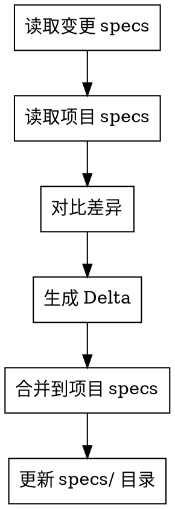
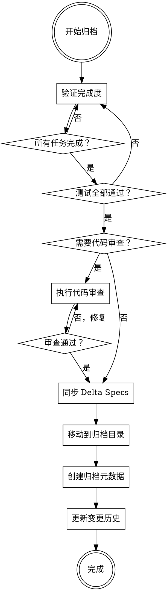

# /super-opsx-archive

验证实现并归档 OpenSpec 变更。

## 概述

此命令在实施完成后进行最终验证，然后归档变更，更新项目的 Delta Specs。

## 执行步骤

### Step 1: 验证完成度

**宣布：** "我正在使用 superpowers:verification-before-completion 技能来验证完成度。"

调用 `superpowers:verification-before-completion`：

1. **检查所有任务完成**
   - 读取 `tasks.md`
   - 确认所有 checkbox 已勾选

2. **检查测试通过**
   - 运行完整测试套件
   - 确认无失败测试

3. **运行 lint/type check**
   - 执行 `npm run lint` 或等效命令
   - 执行 `npm run typecheck` 或等效命令

### Step 2: 可选代码审查

询问用户是否需要代码审查：

> "归档前是否需要代码审查？(y/n)"

如果选择 **是**：

**宣布：** "我正在使用 superpowers:requesting-code-review 技能来请求代码审查。"

调用 `superpowers:requesting-code-review`：
- 创建审查请求
- 等待审查结果
- 处理审查反馈（如有）

### Step 3: 同步 Delta Specs

将变更内容合并到项目的 Delta Specs：

**Delta Spec 操作类型：**

| 操作 | 描述 |
|------|------|
| `ADDED` | 新增的规格 |
| `MODIFIED` | 修改的规格 |
| `REMOVED` | 移除的规格 |

**合并流程：**



### Step 4: 归档变更

移动变更目录到归档位置：

```
openspec/changes/<change-name>/
    ↓
openspec/changes/archive/<YYYY-MM-DD>-<change-name>/
```

**归档后保留的内容：**
- `proposal.md` — 变更意图
- `specs/` — 详细规格
- `design.md` — 技术方案
- `tasks.md` — 实施记录
- `archive-metadata.json` — 归档元数据

### Step 5: 更新归档元数据

创建 `archive-metadata.json`：

```json
{
  "archivedAt": "2026-03-20T14:30:00Z",
  "changeName": "add-user-authentication",
  "status": "completed",
  "tasksCompleted": 8,
  "tasksTotal": 8,
  "testsPassing": true,
  "codeReviewed": true,
  "deltaSpecs": {
    "added": ["auth/jwt", "auth/login"],
    "modified": ["user/model"],
    "removed": []
  }
}
```

### Step 6: 更新变更历史

更新 `openspec/changes/archive/` 下的两个历史文件：

**INDEX.json（机器可读索引）：**

读取现有 INDEX.json（如不存在则创建空数组），追加新条目：

```json
{
  "id": "2026-03-20-add-user-authentication",
  "archivedAt": "2026-03-20T14:30:00Z",
  "status": "completed",
  "testsPassing": true,
  "codeReviewed": true,
  "deltaSpecs": {
    "added": ["auth/jwt", "auth/login"],
    "modified": ["user/model"],
    "removed": []
  }
}
```

**HISTORY.md（人类可读历史）：**

在表格顶部插入新行（最新变更在前）：

```markdown
# 变更历史

| 日期 | 变更 | 状态 | 新增 | 修改 |
|------|------|------|------|------|
| 03-20 | add-user-authentication | ✅ | auth/jwt, auth/login | user/model |
| ...（历史记录）...
```

如 HISTORY.md 不存在，创建新文件：

```markdown
# 变更历史

| 日期 | 变更 | 状态 | 新增 | 修改 |
|------|------|------|------|------|
| 03-20 | add-user-authentication | ✅ | auth/jwt, auth/login | user/model |
```

**状态图标说明：**
- ✅ 完成
- ⏳ 进行中
- ❌ 失败/回滚

## 示例交互

```
You: /super-opsx-archive

AI:  正在验证 add-user-authentication...

     [调用 verification-before-completion]
     ✓ 所有 8 个任务已完成
     ✓ 所有测试通过
     ✓ 无严重问题

     归档前是否需要代码审查？(y/n)

You: y

AI:  [调用 requesting-code-review]
     正在请求审查...
     审查完成。未发现阻塞性问题。

     正在同步 Delta Specs...
     ✓ 已将 auth 需求合并到 openspec/specs/auth/spec.md
     ADDED: auth/jwt, auth/login
     MODIFIED: user/model

     正在归档...
     ✓ 已移动到 openspec/changes/archive/2026-03-20-add-user-authentication/

     变更已成功归档。规格已更新。
```

## 验证清单

归档前必须确认：

| 检查项 | 状态 |
|--------|------|
| 所有任务完成 | ☐ |
| 测试全部通过 | ☐ |
| Lint 检查通过 | ☐ |
| 类型检查通过（如适用）| ☐ |
| 代码审查完成（可选）| ☐ |
| Delta Specs 已更新 | ☐ |

## 归档后操作

归档完成后：

1. **清理工作空间**
   - 如果使用了 git worktree，清理 worktree

2. **合并分支**
   - 如果使用了功能分支，确保已合并

3. **通知用户**
   > "变更已成功归档。规格已更新。项目现在包含新的/更新的规格。"

## 关键原则

1. **证据先行** — 在声称完成前必须有证据
2. **完整性检查** — 所有任务必须完成
3. **测试必须通过** — 零容忍失败测试
4. **保留上下文** — 归档保留完整历史

## 与纯 OpenSpec 的差异

| 维度 | 纯 OpenSpec | super-opsx-archive |
|------|-------------|-------------------|
| 验证流程 | 手动 | verification-before-completion |
| 代码审查 | 无 | requesting-code-review |
| 证据要求 | 宽松 | 严格 |

## 与纯 Superpowers 的差异

| 维度 | 纯 Superpowers | super-opsx-archive |
|------|----------------|-------------------|
| 归档系统 | 无 | OpenSpec archive |
| Delta Specs | 无 | 原生支持 |
| 规格持久化 | 无 | OpenSpec specs/ |

## 流程图



## 下一步

归档完成后，可以：
- 开始新的变更：`/super-opsx-propose <new-change>`
- 查看项目规格：检查 `openspec/specs/`
- 查看归档历史：打开 `openspec/changes/archive/HISTORY.md`
- 查看机器索引：检查 `openspec/changes/archive/INDEX.json`