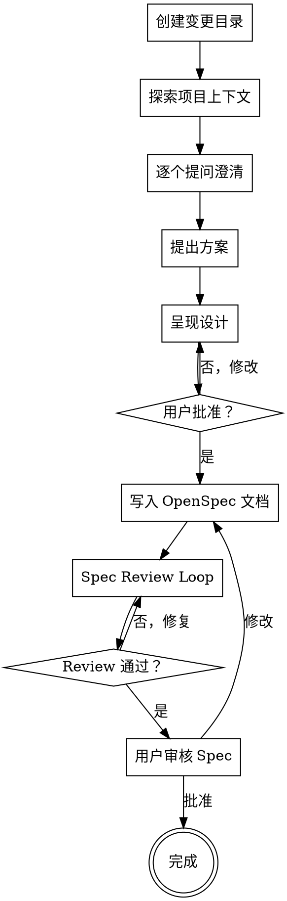

# /super-opsx-propose

创建 OpenSpec 变更并使用 Superpowers brainstorming 探索需求。

## 概述

此命令整合了 OpenSpec 的变更管理能力与 Superpowers 的 brainstorming 流程，在创建规格文档前充分探索需求。

## 执行步骤

### Step 1: 创建变更目录

使用 OpenSpec CLI 创建变更目录结构：

```bash
openspec new <change-name>
```

或手动创建目录：
```
openspec/changes/<change-name>/
├── proposal.md
├── specs/
├── design.md
└── tasks.md
```

### Step 2: 需求探索（Superpowers Brainstorming）

**宣布开始：** "我正在使用 superpowers:brainstorming 技能来探索需求。"

按照 Superpowers brainstorming 流程：

1. **探索项目上下文**
   - 检查文件结构
   - 阅读现有文档
   - 查看最近的 commits

2. **逐个提问澄清问题**
   - 一次只问一个问题
   - 尽量使用多选题
   - 理解：目的、约束、成功标准

3. **提出 2-3 种方案**
   - 包含权衡分析
   - 给出推荐理由

4. **呈现设计并获得批准**
   - 分段呈现，复杂度适中
   - 每段后确认是否正确

### Step 3: 输出到 OpenSpec 结构

将 brainstorming 结果写入 OpenSpec 格式：

| 输出文件 | 内容 |
|---------|------|
| `proposal.md` | intent, scope, approach |
| `specs/*.md` | requirements, scenarios |
| `design.md` | technical approach |
| `tasks.md` | implementation checklist |

### Step 4: Spec Review Loop

1. 调用 Superpowers spec-document-reviewer
2. 如果发现问题：修复，重新提交，重复直到通过
3. 如果循环超过 3 次，请用户提供指导

### Step 5: 用户审核

询问用户审核规格文档：

> "规格文档已写入 `<path>`。请审核后告诉我是否需要修改，然后我们开始创建实施计划。"

## 示例交互

```
You: /super-opsx-propose add-user-authentication

AI:  正在创建 OpenSpec 变更...
     已创建 openspec/changes/add-user-authentication/

     [调用 superpowers:brainstorming]
     我正在使用 superpowers:brainstorming 技能来探索需求。

     让我先了解一下项目上下文...
     [检查现有代码结构]

     您偏好哪种认证方式？
     1. JWT tokens（推荐 - 无状态，支持离线）
     2. Session-based（更简单，需要网络连接）
     3. OAuth 2.0（支持第三方登录）

You: 选择 JWT

AI:  很好的选择，适合您的 API 架构。
     正在编写 OpenSpec 文档...
     ✓ proposal.md - 意图、范围、方法
     ✓ specs/auth/spec.md - 需求、场景
     ✓ design.md - JWT 实现方案
     ✓ tasks.md - 实施清单

     准备开始实施。运行 /super-opsx-apply 开始。
```

## 流程图



## 关键原则

- **一次一个问题** — 不要用多个问题淹没用户
- **优先多选题** — 比开放式问题更容易回答
- **YAGNI 严格** — 从设计中移除不必要的功能
- **探索替代方案** — 始终提出 2-3 种方案
- **增量验证** — 呈现设计，获得批准后再继续

## 与纯 OpenSpec 的差异

| 维度 | 纯 OpenSpec | super-opsx-propose |
|------|-------------|-------------------|
| 需求探索 | 依赖用户输入 | Superpowers brainstorming |
| 文档审核 | 无 | Spec Review Loop |
| 方案对比 | 依赖用户 | 自动提出 2-3 种方案 |

## 与纯 Superpowers 的差异

| 维度 | 纯 Superpowers | super-opsx-propose |
|------|----------------|-------------------|
| 输出格式 | docs/superpowers/specs/ | OpenSpec 结构 |
| 归档支持 | 无 | OpenSpec archive |
| Delta Specs | 无 | 原生支持 |

## 下一步

完成 propose 后，运行 `/super-opsx-apply` 开始实施。