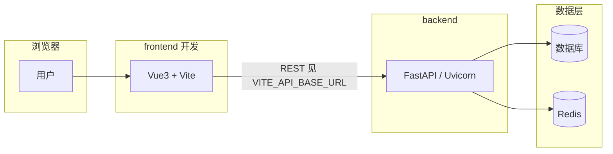

<div align="center">
     <p align="center">
            
     </p>
     <h1>FastApiAdmin <sup style="background-color: #28a745; color: white; padding: 2px 6px; border-radius: 3px; font-size: 0.4em; vertical-align: super; margin-left: 5px;">v2.0.0</h1>
     <h3>现代化全栈快速开发平台</h3>
     <p>如果你喜欢这个项目，给个 ⭐️ 支持一下吧！</p>
     <p align="center">
          <a href="https://gitee.com/fastapiadmin/FastapiAdmin.git" target="_blank">
               
          </a>
          <a href="https://github.com/fastapiadmin/FastapiAdmin.git" target="_blank">
               
          </a>
          <a href="https://gitee.com/fastapiadmin/FastapiAdmin/blob/master/LICENSE" target="_blank">
               
          </a>
           
           
           
           
           
           
           
     </p>

简体中文 | [English](./README.en.md)

</div>

## 📘 项目介绍

**FastApiAdmin** 是一套 **完全开源、高度模块化、技术先进的现代化快速开发平台**，旨在帮助开发者高效搭建高质量的企业级中后台系统。该项目采用 **前后端分离架构**，融合 Python 后端框架 `FastAPI` 和前端主流框架 `Vue3` 实现多端统一开发，提供了一站式开箱即用的开发体验。

> **设计初心**: 以模块化、松耦合为核心，追求丰富的功能模块、简洁易用的接口、详尽的开发文档和便捷的维护方式。通过统一框架和组件，降低技术选型成本，遵循开发规范和设计模式，构建强大的代码分层模型，搭配完善的本地中文化支持，专为团队和企业开发场景量身定制。

## 📖 新手从这儿开始

| 你想…… | 去看 |
|--------|------|
| **最快在本地跑起来** | 下文 **「快速开始」** → **「第一次本地运行（按顺序）」**（含复制环境文件、安装依赖、启动前后端；**首次启动后端会自动初始化库表与基础数据**） |
| **架构图与默认端口（5180 / 8001 等）** | **「本地架构与默认端口」**（与 `.env*.example` 一致） |
| **先了解项目能做什么** | **「内置功能模块」**、**「演示环境」**（账号密码） |
| **做二次开发 / 插件** | **「二开教程」**；后端目录与命令见 [**backend/README.md**](backend/README.md) |
| **接口文档** | 模板下 Swagger：**`http://127.0.0.1:8001/docs`**（端口以 `SERVER_PORT` 为准） |

## 🎯 核心优势

| 优势 | 描述 |
| ---- | ---- |
| 🔥 **现代化技术栈** | 基于 FastAPI + Vue3 + TypeScript 等前沿技术构建 |
| ⚡ **高性能异步** | 利用 FastAPI 异步特性和 Redis 缓存优化响应速度 |
| 🔐 **安全可靠** | JWT + OAuth2 认证机制，RBAC 权限控制模型 |
| 🧱 **模块化设计** | 高度解耦的系统架构，便于扩展和维护 |
| 🌐 **全栈支持** | Web端 + 移动端(H5) + 后端一体化解决方案 |
| 🚀 **快速部署** | Docker 一键部署，支持生产环境快速上线 |
| 📖 **完善文档** | 详细的开发文档和教程，降低学习成本 |
| 🤖 **智能体框架** | 基于Langchain和Langgraph的开发智能体 |

## 🍪 演示环境

- 💻 网页端：[https://service.fastapiadmin.com/web](https://service.fastapiadmin.com/web)
- 📱 移动端：[https://service.fastapiadmin.com/app](https://service.fastapiadmin.com/app)
- 👤 登录账号：`admin` 密码：`123456`

## 🔗 源码仓库

| 平台 | 仓库地址 |
|------|----------|
| GitHub | [FastapiAdmin主工程](https://github.com/fastapiadmin/FastapiAdmin.git) \| [FastDocs官网](https://github.com/fastapiadmin/FastDocs.git) \| [FastApp移动端](https://github.com/fastapiadmin/FastApp.git) |
| Gitee  | [FastapiAdmin主工程](https://gitee.com/fastapiadmin/FastapiAdmin.git) \| [FastDocs官网](https://gitee.com/fastapiadmin/FastDocs.git) \| [FastApp移动端](https://gitee.com/fastapiadmin/FastApp.git) |

## 📦 工程结构概览

```sh
FastapiAdmin
├─ backend               # 后端工程 (FastAPI + Python)
├─ frontend              # Web前端工程 (Vue3 + Element Plus)
├─ devops                # 部署配置
├─ docker-compose.yaml   # Docker编排文件
├─ deploy.sh             # 一键部署脚本
├─ LICENSE               # 开源协议
|─ README.en.md          # 英文文档
└─ README.md             # 中文文档
```

## 🏗️ 本地架构与默认端口

与仓库内 **`backend/env/.env.dev.example`**、**`frontend/.env.development.example`** 保持一致；若你本地已改 `.env.dev` / `.env.development`，以实际文件为准。



| 组件 | 配置项 | 示例默认值（开发模板） |
|------|--------|------------------------|
| 前端页面 | `frontend/.env.development` → `VITE_APP_PORT` | **5180**，即 **`http://127.0.0.1:5180`** |
| 后端 HTTP | `backend/env/.env.dev` → `SERVER_HOST` / `SERVER_PORT` | **`0.0.0.0:8001`**，本机访问 **`http://127.0.0.1:8001`** |
| 前端请求后端 | `VITE_API_BASE_URL` | **`http://127.0.0.1:8001`** |
| API 前缀 | `ROOT_PATH`（后端）+ `VITE_APP_BASE_API`（前端） | 后端 **`/api/v1`**；前端代理前缀 **`/api/v1`** |
| Swagger / Redoc | — | **`http://127.0.0.1:8001/docs`**、`/redoc` |
| WebSocket（可选） | `VITE_APP_WS_ENDPOINT` | 示例 **`ws://127.0.0.1:8001`** |
| 数据库端口 | `DATABASE_PORT` | 模板为 MySQL **`3306`**；PostgreSQL 常见 **`5432`** |
| Redis | `REDIS_HOST` / `REDIS_PORT` | 示例 **`localhost:6379`** |

## 🛠️ 技术栈概览

| 类型 | 技术选型 | 描述 |
|------|----------|------|
| **后端框架** | FastAPI / Uvicorn / Pydantic 2.0 / Alembic | 现代、高性能的异步框架，强制类型约束，数据迁移 |
| **ORM** | SQLAlchemy 2.0 | 强大的 ORM 库 |
| **定时任务** | APScheduler | 轻松实现定时任务 |
| **权限认证** | PyJWT | 实现 JWT 认证 |
| **前端框架** | Vue3 / Vite5 / Pinia / TypeScript | 快速开发 Vue3 应用 |
| **Web UI** | ElementPlus | 企业级 UI 组件库 |
| **移动端** | UniApp / Wot Design Uni | 跨端移动应用框架 |
| **数据库** | MySQL / PostgreSQL / Sqlite | 关系型和文档型数据库支持 |
| **缓存** | Redis | 高性能缓存数据库 |
| **文档** | Swagger / Redoc | 自动生成 API 文档 |
| **部署** | Docker / Nginx / Docker Compose | 容器化部署方案 |
| **智能体框架** | Langchain / Langgraph | 基于Langchain和Langgraph的智能体框架 |

## 📐 后端约定（日期与序列化）

使用 **Pydantic v2** 与 **PostgreSQL（asyncpg）** 时：ORM 写入需要 Python 原生日期时间，JSON 输出需要可序列化字符串。项目通过 `DateStr` / `TimeStr` / `DateTimeStr`（`backend/app/core/validator.py`）的 **`PlainSerializer(..., when_used='json')`** 区分两种场景；统一响应见 `backend/app/common/response.py` 中的 **`jsonable_encoder`**；写入 Redis 时请使用 **`model_dump(mode='json')`** 再序列化。细节见 [backend/README.md](backend/README.md) 中与根文档一致的说明。

## 📌 内置功能模块

| 模块 | 功能 | 描述 |
|------|------|------|
| 📊 **仪表盘** | 工作台、分析页 | 系统概览和数据分析 |
| ⚙️ **系统管理** | 用户、角色、菜单、部门、岗位、字典、配置、公告 | 核心系统管理功能 |
| 👀 **监控管理** | 在线用户、服务器监控、缓存监控 | 系统运行状态监控 |
| 📋 **任务管理** | 定时任务 | 异步任务调度管理 |
| 📝 **日志管理** | 操作日志 | 用户行为审计 |
| 🧰 **开发工具** | 代码生成、表单构建、接口文档 | 提升开发效率的工具 |
| 📁 **文件管理** | 文件存储 | 统一文件管理 |

## 🔧 模块展示

### web 端

| 模块名 <div style="width:60px"/> | 截图 |
| ----- | --- |
| 仪表盘   |  |
| 代码生成  |  |
| 智能助手  |  |

### 移动端

| 登录 <div style="width:60px"/> | 首页 <div style="width:60px"/> | 个人中心 <div style="width:60px"/> |
|----------|----------|----------|
|  |  |  |

## 🚀 快速开始

### 第一次本地运行（按顺序）

1. **安装运行时**：Python ≥ 3.10、Node.js ≥ 20、[pnpm](https://pnpm.io/zh/)（前端包管理）、本机 **MySQL 或 PostgreSQL**（或改用 SQLite 需在 `backend/env/.env.dev` 中配置）、**Redis**（与 `.env.dev` 中一致）。
2. **获取代码**：见下方「获取代码」。
3. **配置环境变量**：将 `backend/env/.env.dev.example` 复制为 `backend/env/.env.dev`，将 `frontend/.env.development.example` 复制为 `frontend/.env.development`，按注释填写 **数据库连接、Redis、JWT 密钥** 等（须先在本机创建空数据库）。
4. **安装后端依赖**：进入 `backend`，推荐使用 **`uv sync`**（见下「后端启动」）；或使用 `pip install -r requirements.txt`。
5. **启动后端**：`uv run main.py run --env=dev`。**首次启动会自动初始化数据库表结构及基础数据**，一般**无需**事先执行 `upgrade` 迁移命令。
6. **安装前端依赖并启动**：进入 `frontend` 执行 `pnpm install` 与 `pnpm run dev`。
7. **打开浏览器**：按模板一般为 **`http://127.0.0.1:5180`**（`VITE_APP_PORT=5180`）；使用管理员账号登录（与 [演示环境](#-演示环境) 一致，若你导入的是初始 SQL 则以后台为准）。

> **说明**：若你**修改了 ORM 模型**并需用 Alembic 管理变更，再使用 `python main.py revision` / `upgrade`（见下文「常见问题」）。

### 环境要求

| 类型 | 技术栈 | 版本 |
|------|--------|------|
| 后端 | Python | ≥ 3.10（推荐 3.12） |
| 后端 | FastAPI | 0.109+ |
| 前端 | Node.js | ≥ 20.0 |
| 前端 | Vue3 | 3.3+ |
| 数据库 | MySQL / PostgreSQL / SQLite | 见 `backend/env` 配置 |
| 缓存 | Redis | 建议 6.x / 7.x（与 `.env` 一致） |

### 获取代码

```bash
# 克隆代码到本地
git clone https://gitee.com/fastapiadmin/FastapiAdmin.git
# 或者
git clone https://github.com/fastapiadmin/FastapiAdmin.git
```

> **后端注意**：克隆下的代码需要修改 `backend/env` 目录下的 `.env.dev.example` 文件为 `.env.dev`，修改 `backend/env` 目录下的 `.env.prod.example` 文件为 `.env.prod`，然后根据实际情况修改数据库连接信息、Redis连接信息等。

> **前端注意**：克隆下的代码需要修改 `frontend` 目录下的 `.env.development.example` 文件为 `.env.development`，修改 `frontend` 目录下的 `.env.production.example` 文件为 `.env.production`，然后根据实际情况修改接口地址等。

### 后端启动

#### 使用 uv（推荐，与 `backend/pyproject.toml` 一致）

```bash
cd backend
uv sync
# 启动：请先保证已创建空数据库、Redis 已启动且与 .env.dev 一致
# 首次启动会自动初始化表与基础数据，无需先执行 upgrade
uv run main.py run --env=dev
# 生产环境示例
# uv run main.py run --env=prod
```

> 若未使用 `uv`：`pip install -r requirements.txt` 后直接 `python main.py run --env=dev`。模型变更需走 Alembic 时再执行 `upgrade`。

#### 使用传统 pip / venv

```bash
cd backend
python -m venv .venv
# Windows: .venv\Scripts\activate
# macOS/Linux: source .venv/bin/activate
pip install -r requirements.txt
python main.py run --env=dev
```

### 前端启动

```bash
cd frontend
pnpm install
pnpm run dev
# 构建生产版本
pnpm run build
```

### 启动后访问

与 **`.env.dev.example` / `.env.development.example`** 对齐时：

| 服务 | 地址（示例） |
|------|----------------|
| 前端 Web（Vite） | `http://127.0.0.1:5180` |
| 后端 API 根 | `http://127.0.0.1:8001` |
| Swagger | `http://127.0.0.1:8001/docs` |
| 业务接口前缀 | `http://127.0.0.1:8001/api/v1`（与 `ROOT_PATH` 一致） |

### 🐳 Docker 部署

#### 方式一：脚本放在项目内执行（推荐）

```bash
# 1. 克隆代码到服务器
git clone https://gitee.com/fastapiadmin/FastapiAdmin.git
cd FastapiAdmin

# 2. 赋予执行权限并部署
chmod +x deploy.sh
./deploy.sh

# 查看容器日志
./deploy.sh logs

# 停止服务
./deploy.sh stop

# 重启服务
./deploy.sh restart

# 更新代码并重启（不重新构建镜像，适合后端代码热更新）
./deploy.sh update
```

#### 方式二：脚本放在项目外执行

```bash
# 1. 将部署脚本复制到服务器
cp deploy.sh /home/
cd /home
chmod +x deploy.sh

# 2. 执行一键部署（会自动克隆项目）
./deploy.sh

# 查看容器日志
./deploy.sh logs

# 停止服务
./deploy.sh stop

# 重启服务
./deploy.sh restart

# 更新代码并重启（不重新构建镜像，适合后端代码热更新）
./deploy.sh update
```

> **注意**：
> - 首次部署时会自动拉取代码并构建镜像
> - 前端使用本地构建的 dist 目录，如需更新前端请先本地构建并提交到仓库
> - 确保 `devops/nginx/ssl/` 目录包含 SSL 证书文件（如使用 HTTPS）

## 🛠️ 二开教程

### 后端开发

项目采用**插件化架构设计**，二次开发建议在 `backend/app/plugin` 目录下进行，系统会**自动发现并注册**所有符合规范的路由，便于模块管理和升级维护。

#### 插件化架构特性

- **自动路由发现**：系统会自动扫描 `backend/app/plugin/` 目录下所有 `controller.py` 文件
- **自动路由注册**：所有路由会被自动注册到对应的前缀路径 (module_xxx -> /xxx)
- **模块化管理**：按功能模块组织代码，便于维护和扩展
- **支持多层级嵌套**：支持模块内部多层级嵌套结构

#### 插件目录结构

```sh
backend/app/plugin/
├── module_application/  # 应用模块（自动映射为 /application）
│   └── ai/              # AI子模块
│       ├── controller.py # 控制器文件
│       ├── model.py      # 数据模型文件
│       ├── schema.py     # 数据验证文件
│       ├── service.py    # 业务逻辑文件
│       └── crud.py       # 数据访问文件
├── module_example/      # 示例模块（自动映射为 /example）
│   └── demo/            # 子模块
│       ├── controller.py # 控制器文件
│       ├── model.py      # 数据模型文件
│       ├── schema.py     # 数据验证文件
│       ├── service.py    # 业务逻辑文件
│       └── crud.py       # 数据访问文件
├── module_generator/    # 代码生成模块（自动映射为 /generator）
└── init_app.py          # 插件初始化文件
```

#### 自动路由注册机制

系统会**自动发现并注册**所有符合以下条件的路由：
1. 控制器文件必须命名为 `controller.py`
2. 路由会自动映射：`module_xxx` -> `/xxx`
3. 支持多个 `APIRouter` 实例
4. 自动处理路由去重

#### 二次开发步骤

1. **创建插件模块**：在 `backend/app/plugin/` 目录下创建新的模块目录，如 `module_yourfeature`
2. **编写数据模型**：在 `model.py` 中定义数据库模型
3. **编写数据验证**：在 `schema.py` 中定义数据验证模型
4. **编写数据访问层**：在 `crud.py` 中编写数据库操作逻辑
5. **编写业务逻辑层**：在 `service.py` 中编写业务逻辑
6. **编写控制器**：在 `controller.py` 中定义路由和处理函数
7. **自动注册**：系统会自动扫描并注册所有路由，无需手动配置

#### 控制器示例

```python
# backend/app/plugin/module_yourfeature/yourcontroller/controller.py
from fastapi import APIRouter, Depends, Path
from fastapi.responses import JSONResponse

from app.common.response import SuccessResponse
from app.core.router_class import OperationLogRoute
from app.core.dependencies import AuthPermission
from app.api.v1.module_system.auth.schema import AuthSchema
from .service import YourFeatureService

# 创建路由实例
YourFeatureRouter = APIRouter(
    route_class=OperationLogRoute, 
    prefix="/yourcontroller", 
    tags=["你的功能模块"]
)

@YourFeatureRouter.get("/detail/{id}", summary="获取详情")
async def get_detail(
    id: int = Path(..., description="功能ID"),
    auth: AuthSchema = Depends(AuthPermission(["module_yourfeature:yourcontroller:detail"]))
) -> JSONResponse:
    result = await YourFeatureService.detail_service(id=id, auth=auth)
    return SuccessResponse(data=result)

@YourFeatureRouter.get("/list", summary="获取列表")
async def get_list(
    auth: AuthSchema = Depends(AuthPermission(["module_yourfeature:yourcontroller:list"]))
) -> JSONResponse:
    result = await YourFeatureService.list_service(auth=auth)
    return SuccessResponse(data=result)
```

#### 开发规范

1. **命名规范**：模块名采用 `module_xxx` 格式，控制器名采用驼峰命名法
2. **权限控制**：所有API接口必须添加权限控制装饰器
3. **日志记录**：使用 `OperationLogRoute` 类自动记录操作日志
4. **返回格式**：统一使用 `SuccessResponse` 或 `ErrorResponse` 返回响应
5. **代码注释**：为所有API接口添加详细的文档字符串

#### 注意事项

- 插件模块名必须以 `module_` 开头
- 控制器文件必须命名为 `controller.py`
- 路由会自动映射到对应的前缀路径
- 无需手动注册路由，系统会自动发现并注册

### 前端部分

1. **配置前端API**：在 `frontend/src/api/` 目录下创建对应的API文件
2. **编写页面组件**：在 `frontend/src/views/` 目录下创建页面组件
3. **注册路由**：在 `frontend/src/router/index.ts` 中注册路由

### 代码生成器使用

项目内置代码生成器，可以根据数据库表结构自动生成前后端代码，大幅提升开发效率。

#### 生成步骤

1. **登录系统**：使用管理员账号登录系统
2. **进入代码生成模块**：在左侧菜单中点击"代码生成"
3. **导入表结构**：选择要生成代码的数据库表
4. **配置生成参数**：填写模块名称、功能名称等
5. **生成代码**：点击"生成代码"按钮
6. **下载或写入**：选择下载代码包或直接写入项目目录

#### 生成文件结构

```sh
# 后端文件
backend/app/plugin/module_yourmodule/
└── yourfeature/
    ├── controller.py # 控制器文件
    ├── model.py      # 数据模型文件
    ├── schema.py     # 数据验证文件
    ├── service.py    # 业务逻辑文件
    └── crud.py       # 数据访问文件

# 前端文件
frontend/src/
├── api/module_yourmodule/
│   └── yourfeature.ts # API调用文件
└── views/module_yourmodule/
    └── yourfeature/
        └── index.vue # 页面组件
```

#### 生成代码示例

```python
# 生成的控制器代码示例
from fastapi import APIRouter, Depends
from fastapi.responses import JSONResponse

from app.common.response import SuccessResponse
from app.core.router_class import OperationLogRoute
from app.core.dependencies import AuthPermission
from app.api.v1.module_system.auth.schema import AuthSchema
from .service import YourFeatureService
from .schema import (
    YourFeatureCreateSchema,
    YourFeatureUpdateSchema,
    YourFeatureQueryParam
)

YourFeatureRouter = APIRouter(
    route_class=OperationLogRoute, 
    prefix="/yourfeature", 
    tags=["你的功能模块"]
)

@YourFeatureRouter.get("/detail/{id}")
async def get_detail(
    id: int, 
    auth: AuthSchema = Depends(AuthPermission(["module_yourmodule:yourfeature:detail"]))
) -> JSONResponse:
    result = await YourFeatureService.detail_service(id=id, auth=auth)
    return SuccessResponse(data=result)
```

### 开发工具

- **代码生成器**：自动生成前后端CRUD代码
- **API文档**：自动生成Swagger/Redoc API文档
- **数据库**：首次启动自动初始化表与基础数据；结构演进可配合 Alembic
- **日志系统**：内置日志记录和查询功能
- **监控系统**：内置服务器监控和缓存监控功能

### 开发流程

1. **需求分析**：明确功能需求和业务逻辑
2. **数据库设计**：设计数据库表结构
3. **代码生成**：使用代码生成器生成基础代码
4. **业务逻辑开发**：完善业务逻辑和接口
5. **前端开发**：开发前端页面和交互
6. **测试**：进行单元测试和集成测试
7. **部署**：部署到生产环境

### 开发注意事项

1. **权限控制**：所有API接口必须添加权限控制
2. **数据验证**：所有输入数据必须进行验证
3. **异常处理**：统一处理API异常
4. **日志记录**：关键操作必须记录日志
5. **性能优化**：注意API性能优化，避免慢查询
6. **代码规范**：遵循PEP8和项目代码规范

### 常见问题

#### Q：如何添加新功能模块？
A：按照二次开发步骤，在 `backend/app/plugin/` 目录下创建新的模块目录，编写相关代码即可。

#### Q：如何配置数据库？
A：在 `backend/env/.env.dev` 或 `backend/env/.env.prod` 文件中配置数据库连接信息。

#### Q：如何配置Redis？
A：在 `backend/env/.env.dev` 或 `backend/env/.env.prod` 文件中配置Redis连接信息。

#### Q：如何生成数据库迁移文件？
A：使用 `python main.py revision --env=dev` 命令生成迁移文件。

#### Q：如何应用数据库迁移？
A：在**需要执行 Alembic 迁移**时使用 `python main.py upgrade --env=dev`（或 `uv run ...`）。**首次启动一般不必先执行**，由应用自动初始化。

#### Q：如何启动开发服务器？
A：在 `backend` 目录执行 `uv run main.py run --env=dev`（或 `python main.py run --env=dev`）。**首次启动会自动初始化数据库与基础数据**，无需先手动执行 `upgrade`。

#### Q：首次启动要先做数据库迁移吗？
A：**一般不需要**。首次启动后端会自动完成库表与初始数据；仅在你**自行修改模型**并需用 Alembic 时再使用 `revision` / `upgrade`。

#### Q：如何构建前端生产版本？
A：使用 `pnpm run build` 命令构建前端生产版本。

#### Q：如何部署到生产环境？
A：使用 `./deploy.sh` 脚本一键部署到生产环境。

## ℹ️ 帮助

更多详情请查看 [官方文档](https://service.fastapiadmin.com)

## 👥 贡献者

<a href="https://github.com/fastapiadmin/FastapiAdmin/graphs/contributors">
  
</a>

## 🙏 特别鸣谢

感谢以下开源项目的贡献和支持：

- [FastAPI](https://fastapi.tiangolo.com/)
- [Pydantic](https://docs.pydantic.dev/)
- [SQLAlchemy](https://www.sqlalchemy.org/)
- [APScheduler](https://github.com/agronholm/apscheduler)
- [Vue3](https://cn.vuejs.org/)
- [TypeScript](https://www.typescriptlang.org/)
- [Vite](https://github.com/vitejs/vite)
- [Element Plus](https://element-plus.org/)
- [UniApp](https://uniapp.dcloud.net.cn/)
- [Wot-Design-UI](https://wot-ui.cn/)

## 🎨 社区交流

| 群组二维码 | 微信支付二维码 |
| --- | --- |
|  |  |

## ❤️ 支持项目

如果你喜欢这个项目，请给我一个 ⭐️ Star 支持一下吧！非常感谢！

[](https://starchart.cc/fastapiadmin/FastapiAdmin)
